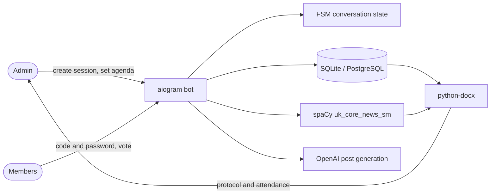

<div align="center">

# 🏛 Youth Council Bot

### A Telegram bot that runs a council meeting from the agenda to the signed protocol

The admin opens a session, members join with a code and a password, everyone votes on each
agenda item separately, and the bot produces the meeting protocol and the attendance appendix
as DOCX files. Built for the Youth Council of the Rava-Ruska city council.

[](LICENSE)


</div>

---

## 🛠 Tech Stack

<div align="center">

**Bot and backend**<br>


**AI and NLP**<br>


**Storage and documents**<br>


</div>

---

## 🎯 What problem it solves

Running a council meeting on paper means one person tracking who is present, who voted how on
each item, and then rewriting all of it into a protocol that has to follow a fixed format.
The bot does the tracking during the meeting and emits the finished documents at the end.

---

## 🎬 Demo

The whole flow runs locally without Telegram, a database or an API key:

```bash
python demo.py
```

```
==============================================================================
1. The admin creates a session
==============================================================================
   Session code: 228782
   Password:     ofwwcgun
   These are shared with the council members, who join from their own Telegram.

==============================================================================
2. Members join
==============================================================================
   joined: Коваль О. І.
   joined: Мельник Д. С.
   joined: Ткаченко І. П.
   joined: Бондар Л. В.
   joined: Шевчук Н. О.
   5 participants registered for the attendance appendix.

==============================================================================
3. Voting, one agenda item at a time
==============================================================================
   Item 1: Про затвердження програми розвитку молоді
      for 5 · against 0 · abstained 0 · did not vote 0
   Item 2: Про створення робочої групи
      for 4 · against 1 · abstained 0 · did not vote 0
   Item 3: Про припинення повноважень члена ради
      for 3 · against 0 · abstained 2 · did not vote 0

==============================================================================
4. The protocol is written in the wording the paperwork requires
==============================================================================
   Agenda item (as submitted)                      Protocol wording (decision)
   ---------------------------------------------------------------------------
   Про затвердження програми розвитку молоді       затвердити програми розвитку молоді
   Про створення робочої групи                     створити робочої групи
   Про припинення повноважень члена ради           припинити повноважень члена ради
```

---

## ✨ Features

### 🗳 Session-based voting

- Admin creates a session; the bot generates a **join code** and a **password**
- Members enter both in their own Telegram and register under their name
- Voting runs **item by item** — the next question opens only when the current one closes
- Each member votes *for*, *against* or *abstains*; the bot records who has already voted
- The admin can close a vote early and see the running tallies

### 📄 Document generation

- **Протокол №N** — decisions and vote tallies for every agenda item, in the required layout
  (Times New Roman 14, fixed margins, numbered items, "Ухвалили" sections)
- **Додаток присутності** — the attendance appendix as a signable table
- Both are sent straight into the chat as DOCX files when the session ends

### 🔤 Ukrainian NLP for the protocol wording

- Agenda items arrive as nominalisations: *"Про затвердження програми"*
- A protocol has to state the decision as a verb: *"затвердити програму"*
- spaCy's `uk_core_news_sm` finds the nominalisation and the bot rewrites it
- Participant names are stored in the genitive case so they read correctly in the document

### 🤖 AI post generation

- Given the details of an event, an OpenAI-backed prompt writes a social media post
- The prompt encodes the council's established style: official tone, up to 700 characters,
  at most three emoji, no hashtags

### 🗄 Council profile and history

- Council name, city, region, chair and secretary are stored once and reused in every protocol
- Sessions are numbered, so protocol numbering continues across meetings

### ⚙️ Runs on either database

- The same async SQLAlchemy layer works on SQLite locally and PostgreSQL via asyncpg in production
- Selected by a single environment variable

---

## 🚀 Quick Start

### Requirements

- Python 3.12+
- A Telegram bot token from [@BotFather](https://t.me/BotFather)
- An OpenAI API key — only needed for the post-generation feature

### Run

```bash
git clone https://github.com/sergiyclas/youth-council-bot.git
cd youth-council-bot
python -m venv .venv && source .venv/bin/activate    # Windows: .venv\Scripts\activate
pip install -r requirements.txt
cp .env.example .env          # fill in the tokens
python app.py
```

The Ukrainian spaCy model is installed from the wheel pinned in `requirements.txt`.
The app runs the bot and a small Flask service side by side.

---

## 🏗 Architecture



**Project layout**

```
bot/
├── handlers/     admin, participant and shared conversation flows
├── keyboards/    inline and reply keyboards per role
├── database/     async SQLAlchemy models, SQLite and PostgreSQL backends
├── middlewares/  database session injection
├── filters/      role-based access checks
└── common/       document generation, OpenAI prompts, Ukrainian NLP
app.py            bot and Flask service entry point
demo.py           full session flow, no tokens required
```

---

## ⚙️ Configuration

| Variable | Description |
|:---|:---|
| `TELEGRAM_TOKEN` | Production bot token |
| `TELEGRAM_TOKEN_TEST` | Token used when `OPTION=test` |
| `API_ID` / `API_HASH` | Telegram API credentials |
| `OPENAI` | OpenAI API key for post generation |
| `DATABASE_URL` | Async database URL |
| `POSTGRESQL` | `true` for PostgreSQL, otherwise SQLite |
| `ALLOWED_ADMINS` | Comma-separated Telegram user ids allowed to run admin commands |
| `GOOGLE_DOCX_URL` | Protocol template document |
| `OPTION` | `test` or `production` |

---

## 📬 Contact

**Serhiy Dzen** – AI Software Engineer

[](mailto:sergiyclas@gmail.com)
[](https://www.linkedin.com/in/sergiyclas/)
[](https://github.com/sergiyclas)

---

<div align="center">

Licensed under the [MIT License](LICENSE)

</div>
