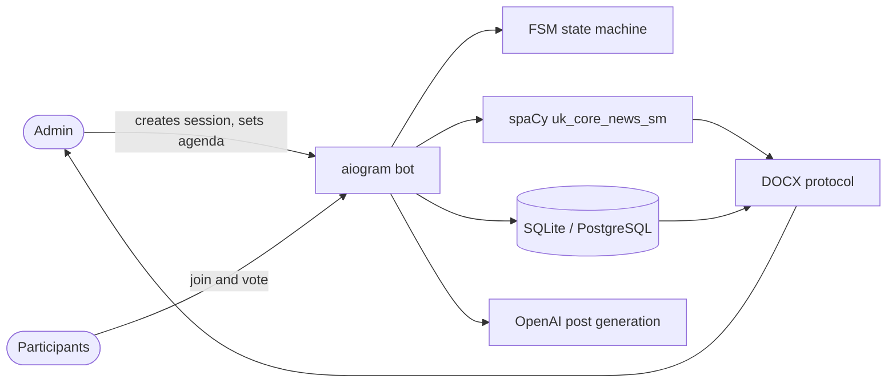

<div align="center">

# 🏛 Youth Council Bot

### A Telegram bot that runs council meetings end to end: agenda, voting, and the signed protocol

Built for the Youth Council of the Rava-Ruska city council. The bot collects the agenda, runs the
vote, and produces the meeting protocol as a DOCX file with the wording the paperwork requires.

[](LICENSE)


</div>

---

## 🛠 Tech Stack

<div align="center">

**Bot and backend**<br>


**AI and NLP**<br>


**Storage and documents**<br>


</div>

---

## 🎬 Demo

The Ukrainian NLP layer runs without Telegram or an API key:

```bash
python demo.py
```

```
Agenda item                                      -> Protocol wording
----------------------------------------------------------------------------------------------
Про затвердження програми розвитку молоді        -> затвердити програми розвитку молоді
Про створення робочої групи                      -> створити робочої групи
Про припинення повноважень члена ради            -> припинити повноважень члена ради
Про оголошення конкурсу проєктів                 -> оголосити конкурсу проєктів
Про розгляд звернення мешканців                  -> розглянути звернення мешканців
```

Agenda items are written as nominalisations, while a protocol has to state a decision in the
infinitive. The bot rewrites them automatically instead of asking the secretary to do it by hand.

---

## 🚀 Quick Start

### Requirements

- Python 3.12+
- A Telegram bot token from [@BotFather](https://t.me/BotFather)
- An OpenAI API key (only for the post-generation feature)

### Run

```bash
git clone https://github.com/sergiyclas/youth-council-bot.git
cd youth-council-bot
python -m venv .venv && source .venv/bin/activate    # Windows: .venv\Scripts\activate
pip install -r requirements.txt
cp .env.example .env          # fill in the tokens
python app.py
```

The Ukrainian spaCy model is installed from the wheel listed in `requirements.txt`.
The app runs the bot and a small Flask service side by side.

---

## ✨ Features

### Runs the whole meeting

An admin creates a session with a password, sets the agenda, and starts the vote. Participants join
with that password, vote item by item, and the bot tracks who voted for what.

### Produces the protocol, not just the numbers

When the vote ends, the bot fills a DOCX template with the decisions, the vote tallies and the
participant list, in the wording the council's paperwork requires.

### Ukrainian NLP for correct wording

The agenda is written as "Про затвердження ..."; a protocol needs "затвердити ...". The bot uses
spaCy's Ukrainian model to detect the nominalisation and rewrite it, and stores the declined forms
of participants' names so they read correctly in the document.

### Generates social media posts

Given the details of an event, an OpenAI-backed prompt produces a post in the council's established
style: official tone, a length limit, and at most three emoji.

### Works on either database

The same async SQLAlchemy layer runs on SQLite for local use or PostgreSQL through asyncpg in
production, selected by an environment variable.

---

## 🏗 Architecture



**Project layout**

```
bot/
├── handlers/     admin, participant and shared conversation flows
├── keyboards/    inline and reply keyboards per role
├── database/     async SQLAlchemy models, SQLite and PostgreSQL backends
├── middlewares/  database session injection
├── filters/      role-based access checks
└── common/       OpenAI prompts, the Ukrainian NLP converter, utilities
app.py            bot and Flask service entry point
demo.py           NLP layer demo, no tokens required
```

---

## ⚙️ Configuration

| Variable | Description |
|:---|:---|
| `TELEGRAM_TOKEN` | Production bot token |
| `TELEGRAM_TOKEN_TEST` | Token used when `OPTION=test` |
| `API_ID` / `API_HASH` | Telegram API credentials |
| `OPENAI` | OpenAI API key for post generation |
| `DATABASE_URL` | Async database URL |
| `POSTGRESQL` | `true` to use PostgreSQL, otherwise SQLite |
| `GOOGLE_DOCX_URL` | Protocol template document |
| `OPTION` | `test` or `production` |

---

## 📬 Contact

**Serhiy Dzen** – AI Software Engineer

[](mailto:sergiyclas@gmail.com)
[](https://www.linkedin.com/in/sergiyclas/)
[](https://github.com/sergiyclas)

---

<div align="center">

Licensed under the [MIT License](LICENSE)

</div>
